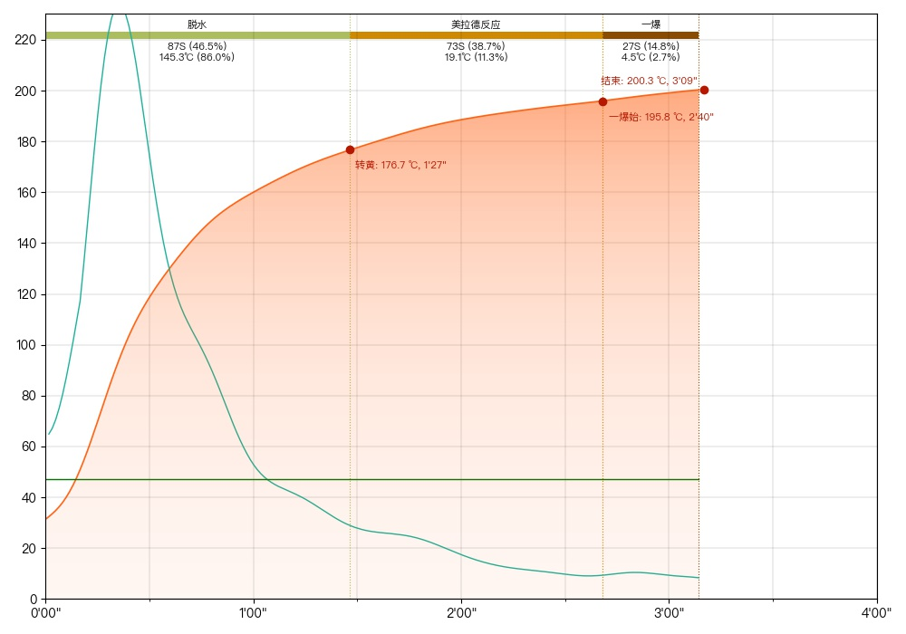

Export RoastMaster roast data to Artisan format

### Curve in Roast Master

### Curve in Artisan

#### How To Use

1. clone this repo
2. `python3 roast_master_plus/artisan.py /path/to/the/directory/of/.dat/files`
3. import the exported json files (in `artisan/` folder) in Artisan "File -> Import -> Artisan JSON"
